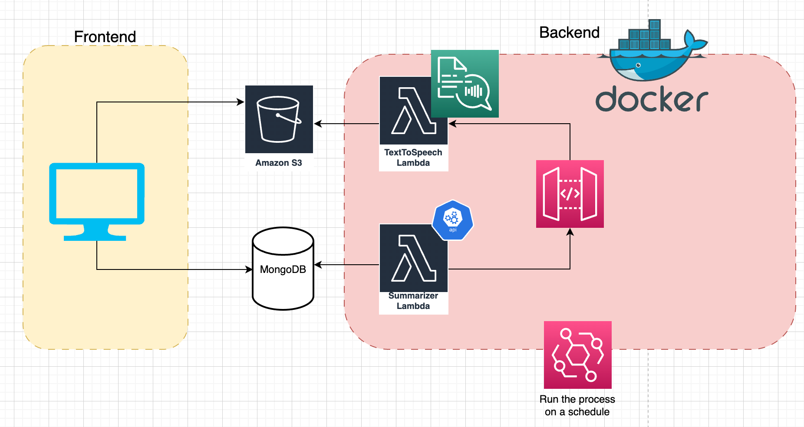

# Acta frontend

[Acta](https://acta.fyi) is a newsletter powered by AI. Weekly, top articles for a subscribed topic are gathered from the internet. A model summarizes the article and another service reads the article text out loud.

Frontend is built in next.js and tailwind.css. This app gets the most recent article entries and their summaries from the database and displays them. Additionally, pre-generated audio recording of the article is also embedded from S3.

